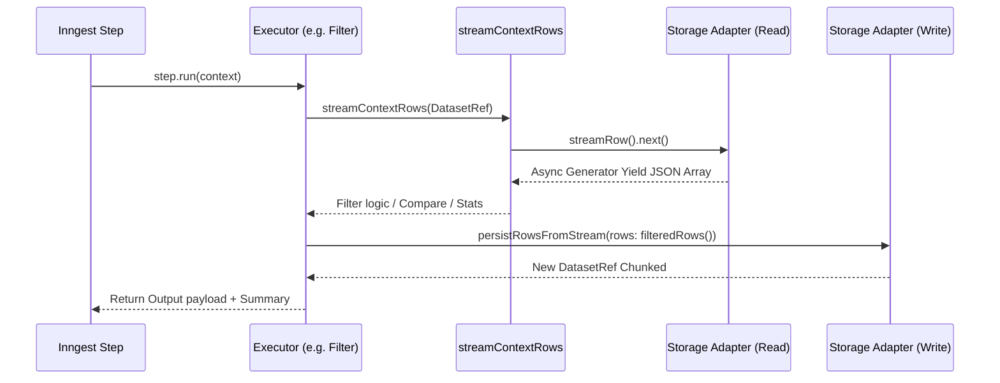

# Downstream Nodes: Architecture Q&A

This document provides detailed answers to questions regarding how downstream execution nodes (Filter, Sort, Join, etc.) process datasets, manage memory, and interact with the Inngest execution engine.

---

## GROUP 1 — How downstream nodes read data

**When a node like CSV Filter or CSV Sort receives a `DatasetRef`, does it call `datasetService.getDatasetRowsByPage()` in a loop, or does it try to load all rows at once into a single array first?**

**Neither.** Downstream nodes stream data line-by-line using native Node.js read streams. They do **not** use the `getDatasetRowsByPage()` method, which is strictly designed for UI pagination and table views. Similarly, they do not attempt to load all rows into an array (unless the fast-path conditions are met for datasets `< 5000` rows).

Instead, they rely on an async generator pipeline that reads chunks continuously from disk:
```typescript
// From src/features/executions/server/datasets/jsonl-storage-adapter.ts
async *streamRows(executionId: string, datasetId: string): AsyncGenerator<DatasetRow, void, void> {
  const manifest = await this.getManifest(executionId, datasetId);
  for (const chunk of manifest.chunks) {
    const chunkPath = getDatasetChunkPath(executionId, datasetId, chunk.fileName);
    const stream = createReadStream(chunkPath, { encoding: "utf-8" });
    const reader = createInterface({ input: stream, crlfDelay: Infinity });

    for await (const line of reader) {
      if (line.trim()) yield JSON.parse(line);
    }
  }
}
```

**Is there a shared base class or utility function all CSV nodes use to iterate rows, or does each node implement its own reading logic independently?**

Yes. All downstream CSV operators use a shared generator utility called `streamContextRows(source)`. This utility abstracts whether the incoming data is a `DatasetRef` (triggering external storage streams) or an inline array (yielding items immediately).

```typescript
// From src/features/executions/components/csv-shared/executor-utils.ts
export const streamContextRows = async function* (value: unknown) {
  if (isDatasetRef(value)) {
    for await (const row of datasetService.streamDatasetRows(value.executionId, value.datasetId)) {
      yield normalizeRowAtReadBoundary(row, value.schema);
    }
    return;
  }
  for (const row of extractInlineRows(value)) {
    yield row;
  }
};
```

**What is the current page size used when reading rows from chunks — is it the same `CSV_WRITE_BATCH_SIZE = 25000` or a different value?**

Pagination is completely abstracted away during reads (the parser just yields `line` by `line`). When writing data back out, the default chunk size is governed by `DATASET_STORAGE.DEFAULT_CHUNK_SIZE_ROWS` (located in `constants.ts`), which is currently defaulting to **1,000**, not 25,000. 

### Diagram: Downstream Node Data Flow


---

## GROUP 2 — How nodes write their output

**When a node like CSV Filter produces its result, does it write back to a new `DatasetRef + chunked JSONL`, or does it return the filtered rows as a raw array in the Inngest context?**

Nodes write their results out sequentially via `datasetService.persistRowsFromStream(generator)`, creating a **new** `DatasetRef` pointing to brand new chunked JSONL files.

```typescript
// From src/features/executions/components/csv-filter/executor.ts
const filteredRows = async function* () {
  for await (const row of streamContextRows(source)) {
    if (applyCsvPredicate(row, field, operator, value)) yield row;
  }
};

const manifest = await datasetService.persistRowsFromStream({
  executionId,
  variableName,
  rows: filteredRows(), // Stream passed directly to writer
  chunkSize: DATASET_STORAGE.DEFAULT_CHUNK_SIZE_ROWS,
  schema: sourceSchema,
});

return { ...toDatasetRefOutput(manifest) };
```

**Does `assertNoLargeArrayOutput` actually catch cases where filtered/sorted results are returned inline, or is it only checked at the CSV Parse stage?**

It catches everything safely. In `src/inngest/functions.ts`, the `assertNoLargeArrayOutput` function is executed after **every single node output evaluation** within the workflow loop. If ANY node returns an inline array that exceeds `MAX_INLINE_DATASET_ROWS` (5,000), it will immediately fail the execution.

```typescript
// From src/inngest/functions.ts inside the big node execution loop
const output = await executor({ /* ... */ });

assertNoLargeArrayOutput({
  nodeId: node.id,
  nodeType: String(node.type),
  output,
});
```

---

## GROUP 3 — Node-specific concerns

There are significant architectural differences in how each downstream node allocates memory. While reading is strictly bounded and streaming, semantic processing sometimes requires holding data in memory.

### CSV Sort (Safely Streamed)
**Does it load everything into memory to sort?**
CSV Sort is **completely memory-safe**. It uses an external merge sort algorithm `externalSortRows()` from `external-sort.ts`. Elements are loaded into memory until they hit a predefined constraint `EXTERNAL_SORT_RUN_TARGET_BYTES`. That chunk is sorted and dumped to a `TempFileManager`. At the very end, all generated temporary chunks are streamed and merged using an N-way max-heap fan-in `EXTERNAL_SORT_MAX_FAN_IN`. It does not load the full dataset into memory.

### CSV Join (Heavy Memory Risk)
**Does it load both DatasetRefs fully into memory, or does it stream one side?**
CSV Join utilizes a Hash Join (`hashJoinRows` in `hash-join.ts`). It loads the `buildSide` **fully into an array in memory**, which makes it prone to Out-Of-Memory (OOM) errors if the build side involves a high row-count. It streams the `probeSide` safely, but the memory usage scales linearly `O(N)` with the size of the chosen build dataset.
```typescript
const buildMaterialized: Array<Record<string, unknown>> = [];
for await (const row of buildRows) {
  buildMaterialized.push(row); // <--- Dangerous for huge Datasets
}
```

### CSV Deduplicate (Not Implemented)
**Does it accumulate a hashset in memory?**
It is temporarily mapped to a `stubExecutor` in `executor-registry.ts` and drops all logic. It is **not implemented yet**.

### CSV Aggregate (Moderate Memory Risk)
**Does it stream rows and accumulate group counters, or load all rows first?**
It streams the rows sequentially, but maintains a `Map` of "buckets" in memory for the aggregated metrics (min, max, count, sums). Memory footprint is bounded strictly by the **cardinality of the grouping keys**, not the raw row counts. So high-cardinality keys could trigger bounds limits.

### CSV Column Stats (Extreme Memory Risk)
**Streaming accumulators or full load?**
It streams sequentially, but stores every unique discrete string value into memory for frequency tabulation.
```typescript
// From csv-column-stats/executor.ts
entry.uniqueValues.add(serialized); // Memory leak risk for unique IDs
```
If generating column stats for a 1M-row dataset with high-cardinality values (e.g. unique UUIDs), it will store 1M strings in memory, almost certainly tripping Vercel Serverless or Docker memory limits or internal Pipeline Memory Budgets.

---

## GROUP 4 — Execution model

**Do these nodes run inside Inngest `step.run()` blocks with the same single-monolithic-step pattern the old CSV Parse had, or are they already chunked/resumable?**

They run inside **single-monolithic steps**. For example, `csv-sort` wraps its entire logic inside a `const output = await step.run("csv-sort", async () => { ... })`. If the Inngest step crashes midway through a heavy 20-minute join, the *entire* node logic re-executes. The operations are not resumable natively at the sub-chunk checkpoint level in Inngest (though data writing happens safely).

**Is there a timeout or memory guard on any of these nodes?**

Yes. The nodes are guarded dynamically by `src/features/executions/server/resource-budget.ts`. If an external sort attempts to exceed `DATASET_STORAGE.MAX_TOTAL_DISK_USAGE_BYTES` or a buffer exceeds `MAX_PIPELINE_MEMORY_BYTES`, the system throws a `throwBudgetExceeded` hard error. Timeout limitations are bounded implicitly by Vercel max duration ceilings attached to the `/api/inngest` endpoint.

**Are any of these nodes flagged as "heavy" in the Redis queue profile?**

Yes. `queue-policy.ts` flags `CSV_PARSE`, `CSV_SORT`, `CSV_JOIN`, `CSV_COMPARE`, `CSV_AGGREGATE`, and `CSV_COLUMN_STATS` as `"heavy"`. Only a limited number governed by `DATASET_STORAGE.MAX_CONCURRENT_HEAVY_EXECUTIONS` will run concurrently across the system. `CSV_FILTER` operates continuously as standard priority.

---

## GROUP 5 — Code access

### High Priority: Join Executor Memory Leak Risk
```typescript
// src/features/executions/server/datasets/hash-join.ts (Dangerous Load)
export const hashJoinRows = async function* ({ buildSide, leftRows, rightRows, leftKey, rightKey }) {
    const buildOnLeft = buildSide === "left";
    const buildRows = buildOnLeft ? await toAsyncIterable(leftRows) : await toAsyncIterable(rightRows);

    // ALL rows loaded to memory here:
    const buildMaterialized: Array<Record<string, unknown>> = [];
    for await (const row of buildRows) {
      buildMaterialized.push(row);
    }
  // ...
}
```

### High Priority: Column Stats Memory Leak Risk
```typescript
// src/features/executions/components/csv-column-stats/executor.ts
const consumeRow = (row: Record<string, unknown>) => {
  for (const field of fields) {
    const entry = stats.get(field);
    const serialized = String(row[field]);
    // SET grows infinitely with rows
    entry.uniqueValues.add(serialized); 
    // MAP scales with cardinality
    entry.frequencies.set(serialized, (entry.frequencies.get(serialized) || 0) + 1);
  }
};
```

### Unimplemented Node: Deduplicate
```typescript
// src/features/executions/components/lib/executor-registry.ts
export const executorRegistry = {
  // ...
  [NodeType.CSV_DEDUPLICATE]: stubExecutor, // Not implemented!
}
```

### Largest Dataset Benchmark Provided
The largest dataset formally proven and tracked by a benchmark runner inside the repository is **400MB**, validated by the script located at `scripts/bench/execution-400mb-benchmark.ts` targeting Columnar & JSONL stream metrics.
